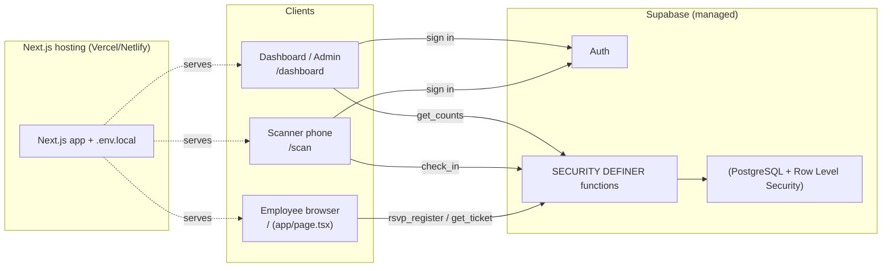
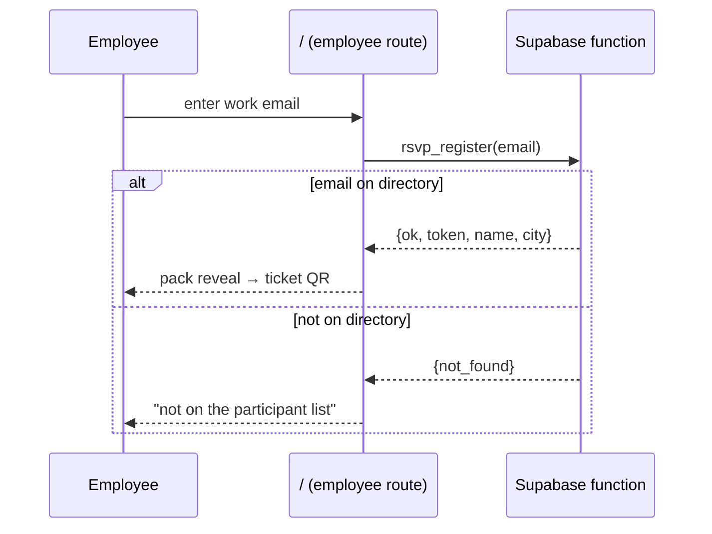
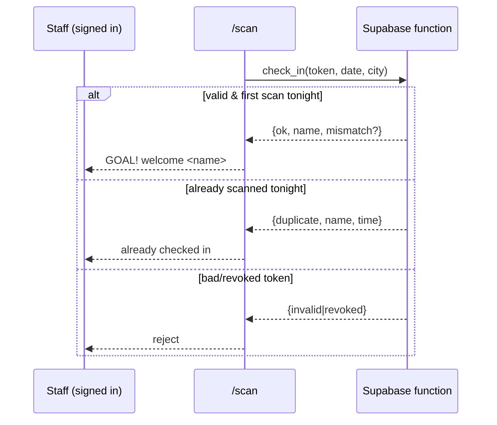

# Architecture

## 1. Overview
The system is a single **Next.js** app (three routes) backed by a single managed database. The pages are client‑rendered and call Supabase directly, and **all data access goes through locked‑down database functions** so the app never touches tables directly. This keeps the moving parts minimal while still giving real‑time, shared state across the three cities.

## 2. Components
- **Employee route (`/` → `app/page.tsx`)** — public. RSVP by work email, then renders the ticket (pack reveal + QR). Calls `rsvp_register` and `get_ticket`.
- **Scanner route (`/scan`)** — staff only. Sign in, choose city + night, scan QR via the phone camera. Calls `check_in`.
- **Dashboard / admin route (`/dashboard`)** — staff only. Live attendance and ticket management. Calls `get_counts` and admin functions.
- **Shared lib (`lib/supabase.ts`)** — the single browser client plus typed wrappers over the function API; `lib/celebrate.ts` holds the synthesized sound + confetti.
- **Backend (Supabase)** — PostgreSQL with Row Level Security, Supabase Auth for staff, and the functions that form the entire API surface.

## 3. Tech stack & rationale
| Choice | Why |
|---|---|
| **Supabase (PostgreSQL)** | Managed, internet‑reachable from any phone on cellular, real‑time capable, generous free tier, and Postgres feels familiar coming from SQL Server. |
| **Next.js (App Router)** | One app, one deploy, shared components and typed API wrappers across the three surfaces. Client‑rendered pages keep all logic in the browser calling Supabase directly — no custom server to maintain. Deploys to Vercel/Netlify in one step. |
| **Functions‑only API (SECURITY DEFINER)** | Tables stay locked by RLS; the app can only do the few specific things the functions allow. Prevents directory enumeration and tampering. |
| **QR encodes an opaque token** | The QR carries only a random token, not personal data; the scanner resolves it server‑side. |

## 4. Key flows

**Registration**

**Check‑in**

## 5. Deployment topology
- **Frontend:** the Next.js app is deployed to Vercel or Netlify (`npm run build`). One public URL for employees at `/`; the scanner (`/scan`) and dashboard (`/dashboard`) are routes on the same host, gated by staff login.
- **Backend:** a single Supabase project (pick an EU/near region). The schema, functions, and seed data are applied once via the SQL editor.
- **Config:** the build reads `NEXT_PUBLIC_SUPABASE_URL` and `NEXT_PUBLIC_SUPABASE_ANON_KEY` from `.env.local` (set as environment variables in the host). These are public by design; the service‑role key never appears in the app.

## 6. State, real‑time, and concurrency
- The dashboard refreshes attendance by polling `get_counts` on a short interval — simple and robust; Supabase real‑time subscriptions are an optional upgrade.
- Double‑scan safety is enforced in the database by a uniqueness constraint on `(ticket_id, event_id)`, so even simultaneous scans from two phones cannot double‑count.

## 7. Failure modes & resilience
| Risk | Mitigation |
|---|---|
| No connectivity at a door | Fallback to a printed/exported attendee list for manual ticking; reconcile later. Plan a connectivity check per venue beforehand. |
| Supabase outage | Low probability for the window; the manual list is the universal fallback. |
| Lost/forgotten ticket | Employee re‑opens the RSVP page with the same email and gets the same ticket back (idempotent), or staff resend from admin. |
| Key leakage | The anon key is public by design; RLS + functions mean it grants no table access. |

## 8. Scalability
The design is bounded by Supabase's managed Postgres, which comfortably handles thousands of employees and the modest write rate of door scans. No component holds per‑user server state, so concurrent scanning across three cities scales naturally.
