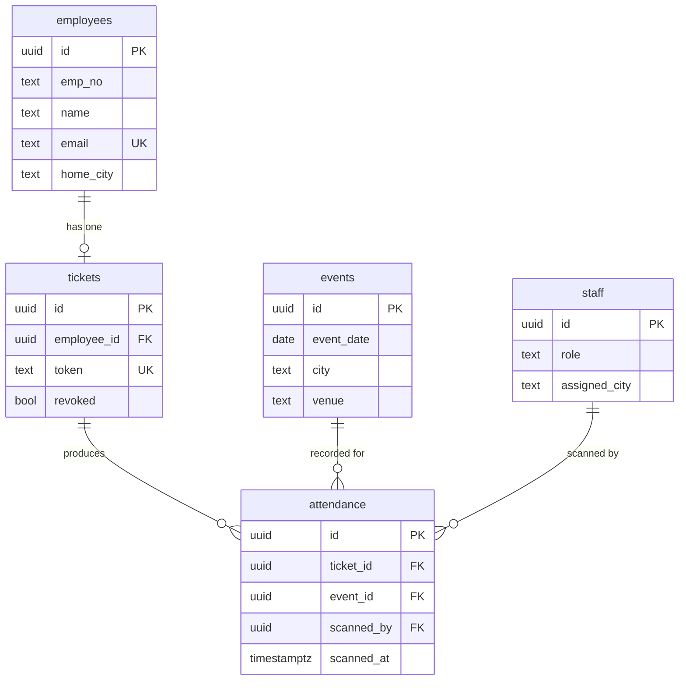

# Data model & API contract

The authoritative definition is `schema.sql`. This document explains it.

## 1. Entity relationships

## 2. Tables

**employees** — the private directory / eligibility list (the data you import).
| Column | Type | Notes |
|---|---|---|
| id | uuid | primary key |
| emp_no | text | employee number (optional) |
| name | text | display name |
| email | text | unique; matched on RSVP (case‑insensitive) |
| home_city | text | `Tripoli` / `Benghazi` / `Misrata` |
| created_at | timestamptz | default now |

**tickets** — one per registered employee, valid all nights.
| Column | Type | Notes |
|---|---|---|
| id | uuid | primary key |
| employee_id | uuid | → employees; **unique** (one ticket per person) |
| token | text | unique; the QR payload (opaque, unguessable) |
| rsvp_at | timestamptz | when they registered |
| revoked | boolean | default false |

**events** — the 8 × 3 grid, seeded by `schema.sql`.
| Column | Type | Notes |
|---|---|---|
| id | uuid | primary key |
| event_date | date | one of the eight nights |
| city | text | venue city |
| venue | text | e.g. "Cafeteria + Parking" |
| kickoff | text | default "20:00" |
|  |  | **unique (event_date, city)** |

**attendance** — one row per ticket per night.
| Column | Type | Notes |
|---|---|---|
| id | uuid | primary key |
| ticket_id | uuid | → tickets |
| event_id | uuid | → events |
| scanned_by | uuid | → auth user (staffer) |
| scanned_at | timestamptz | default now |
|  |  | **unique (ticket_id, event_id)** — the anti‑double‑count rule |

**staff** — scanner/admin accounts, linked to Supabase Auth.
| Column | Type | Notes |
|---|---|---|
| id | uuid | = auth user id |
| display_name | text | e.g. "Door – Tripoli" |
| role | text | `scanner` or `admin` |
| assigned_city | text | optional default city for the scanner |

## 3. Access model
All tables have Row Level Security enabled with **no broad read/write policies**. The apps never query tables directly; they call the functions below, which run with definer rights and enforce their own checks. This is what keeps the directory private and check‑in staff‑only.

## 4. Function (API) contract

| Function | Caller | Params | Returns (status + fields) |
|---|---|---|---|
| `rsvp_register(p_email)` | anyone | email | `ok` (token, name, emp_no, city) · `exists` (same fields) · `not_found` |
| `get_ticket(p_token)` | anyone | token | `ok` (name, emp_no, city, token) · `revoked` · `invalid` |
| `check_in(p_token, p_date, p_city)` | staff | token, date, city | `ok` (name, home_city, mismatch) · `duplicate` (name, time) · `invalid` · `revoked` · `no_event` · `unauthorized` |
| `get_counts()` | staff | — | `ok` (issued, attendees, rows[{event_date, city, cnt}]) · `unauthorized` |

Notes:
- `rsvp_register` is **idempotent** — registering twice returns the existing ticket, never a second one.
- `check_in` records against `(date, city)` and reports `mismatch = true` when the attendee's home city differs from the scanning city (allowed, just flagged).
- Staff‑only functions verify the caller exists in `staff`; otherwise they return `unauthorized`.

## 5. Admin functions (built; used by `/dashboard`)
Same pattern (staff‑only, definer), in `schema.sql`:
- `resend_ticket(p_email)` → returns the token/link for an existing registrant.
- `revoke_ticket(p_token)` / `restore_ticket(p_token)` → toggle `revoked` (admin role).
- `event_roster(p_date, p_city)` → list of attendees for one night (for export / manual fallback).
